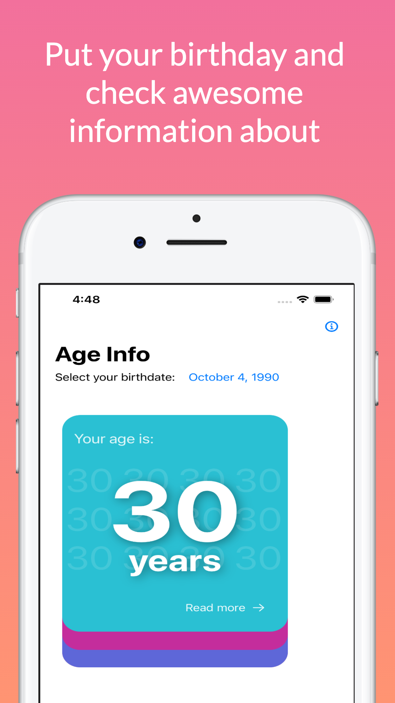

# CI/CD Status

| DEV       |
| :------------- | 
| build | More Stuff   |
|  |

# Age Info EN
Get your current age, your friends or your partner, you will find a fun math phrase related to the age, a historical event that occurred in the year of your birth, you will also get the zodiac sign and what Chinese animal represents you.
Discover what the stars of your zodiac sign have for you you every day by consulting the horoscope card after having entered your birthday, you can also learn about some traits of your personality based on your Chinese horoscope animal.
Are you from the baby boomers generation, X or Millennials? You will be able to know which generation you belong to by consulting the information of your birthday. Download it right now from the [App Store] (https://apps.apple.com/app/age-info/id1569664398?ign-mpt=uo%3D5)

## Features
- Enter the your birthday, your friends or partner to get the current age.
- Surprise yourself with a mathematical fact of the age number.
- Find out under which zodiac sign you were born.
- Look what the horoscope has for you every day.
- In the Chinese calendar there is an animal that represents people born in a year.
- Unique qualities of 12 animals that represent the Chinese zodiac.
- Learn about the social generations and which one identifies you.
- And an historical event that happened in the year you were born

# AgeInfo ES
Calcula tu edad actual la tus amigos o tu pareja, encontrarás una divertida frase de matematicas relacionada a la edad, un acontecimiento historico ocurrido en el año de tu nacimiento, ademas obtendras el signo zodiacal y que animal chino te representa.
Descubre que te ofrecen las estrellas de tu signo zodiacal todos los dias consultando la tarjeta del horoscopo despues de haber ingresado tu fecha, tambien podras aprender sobre algunos rasgos de tu personalidad basado en tu animal del horoscopo chino.
Eres de la generacion baby boomers, X o Millenials ? Podras saber a que generacion perteneces consultando la informacion de tu fecha de nacimiento. Descargala ya mismo de la [App Store](https://apps.apple.com/app/age-info/id1569664398?ign-mpt=uo%3D5)

## Caracteristicas: 
- Ingresa la fecha de nacimiento tuya, de tus amigos o pareja para obtener la edad actual.
- Sorprendete con un dato matematico del numero de la edad.
- Descubre bajo cual signo del zodiaco naciste
- Mira que tiene el horoscopo del dia para ti
- En el calendario chino existe un animal que representa las personas nacidas en un año
- Cualidades unicas de 12 animales que representan el zodiaco chino
- Aprende sobre las generaciones sociales y cual te identifica
- Y un acontecimiento sucedido en el año en el que nacio
